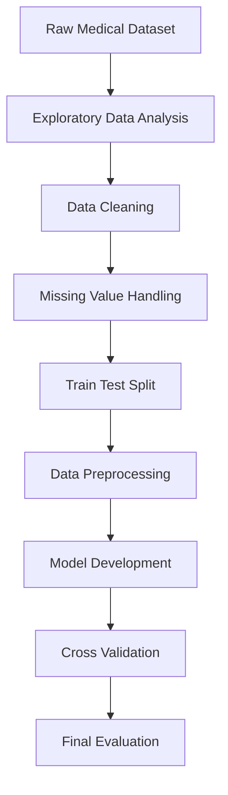

# Pima-Indiana-Diabetes
End-to-end machine learning project for diabetes prediction using the Pima Indians Diabetes Dataset, including EDA, preprocessing, Logistic Regression modeling, ROC-AUC evaluation, and cross validation.
# Pima Indians Diabetes Prediction

> End-to-end machine learning project focused on predicting diabetes risk using medical diagnostic data through a structured data science workflow.

---

# Executive Summary

This project analyzes the Pima Indians Diabetes Dataset to simulate a real-world healthcare machine learning workflow commonly performed by:

* Data Scientists
* Machine Learning Engineers
* Healthcare Analytics Teams

The project transforms raw medical datasets into predictive machine learning models through:

* data cleaning,
* exploratory data analysis (EDA),
* missing value handling,
* preprocessing,
* model development,
* and evaluation analysis.

The primary objective is to build a machine learning model capable of predicting whether a patient is likely to have diabetes based on medical measurements.

---

# Business Problem

Early diabetes detection is critical in healthcare because delayed diagnosis may lead to serious long-term complications.

However, medical screening processes often face challenges such as:

* delayed diagnosis,
* limited medical resources,
* inconsistent risk assessment,
* and difficulty identifying high-risk patients efficiently.

This project aims to support healthcare decision-making by developing a predictive machine learning model that can assist in identifying patients with higher diabetes risk.

The project attempts to answer the following question:

> Can patient medical measurements be used to predict diabetes risk effectively?

Understanding these patterns may help healthcare providers:

* improve early screening,
* prioritize high-risk patients,
* support preventive treatment,
* and enhance medical decision-making.

---

# Why This Project Matters

Diabetes is one of the most common chronic diseases worldwide.

Machine learning can help healthcare organizations:

* improve early disease detection,
* support clinical decision-making,
* reduce manual screening workload,
* and identify hidden risk patterns from medical data.

This project demonstrates how healthcare datasets can be transformed into predictive analytical systems using structured machine learning workflows.

The workflow used in this project reflects practical tasks commonly found in:

* healthcare analytics,
* clinical machine learning,
* predictive healthcare systems,
* and medical AI research.

---

# Dataset

Dataset Used:

* Pima Indians Diabetes Dataset

Dataset Source:

* [https://www.kaggle.com/datasets/uciml/pima-indians-diabetes-database](https://www.kaggle.com/datasets/uciml/pima-indians-diabetes-database)

The dataset contains several medical diagnostic measurements from female patients, including:

* glucose level,
* blood pressure,
* insulin,
* BMI,
* age,
* pregnancy count,
* and diabetes pedigree function.

---

# Machine Learning Objective

## Business Question

> Can diabetes risk be predicted using patient medical information?

---

## Machine Learning Framing

* **Problem Type**: Supervised Learning
* **Task**: Binary Classification
* **Target Variable**: `Outcome`

### Target Definition

* `1` → Diabetes
* `0` → Non-Diabetes

The model generates probability predictions to estimate diabetes risk.

---

# Input Features

## Numerical Features

| Feature | Description |
|---|---|
| Pregnancies | Number of pregnancies |
| Glucose | Plasma glucose concentration |
| BloodPressure | Diastolic blood pressure |
| SkinThickness | Triceps skin fold thickness |
| Insulin | 2-Hour serum insulin |
| BMI | Body mass index |
| DiabetesPedigreeFunction | Diabetes hereditary likelihood |
| Age | Patient age |

---

# Analytical Approach

The project follows a structured end-to-end machine learning workflow:

1. Data Loading
2. Exploratory Data Analysis (EDA)
3. Data Cleaning
4. Missing Value Handling
5. Train-Test Split
6. Data Preprocessing
7. Model Development
8. Cross Validation
9. Final Model Evaluation

The analysis prioritizes:

* medical interpretation,
* model reliability,
* and structured machine learning practices.

---

# Workflow Architecture

---
