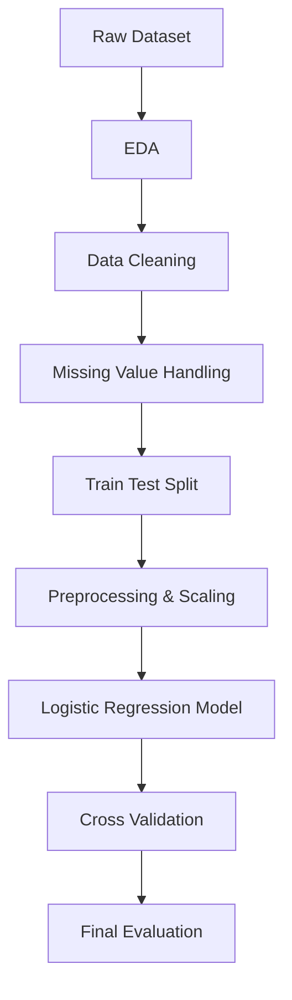

# 🩺 Pima Indians Diabetes Prediction

End-to-end healthcare machine learning project using the Pima Indians Diabetes Dataset to predict diabetes risk through EDA, preprocessing, Logistic Regression, ROC-AUC evaluation, and cross validation.

---

# 🚀 Project Overview

This project focuses on building a machine learning model capable of predicting diabetes risk using patient medical diagnostic measurements.

The workflow simulates a real-world healthcare machine learning pipeline including:

- Exploratory Data Analysis (EDA)
- Data Cleaning
- Missing Value Handling
- Feature Scaling
- Logistic Regression Modeling
- Cross Validation
- ROC-AUC Evaluation
- Confusion Matrix Analysis

The project emphasizes both:
- technical machine learning implementation,
- and healthcare-oriented model interpretation.

---

# 🎯 Business Objective

The main objective of this project is to assist healthcare screening processes by identifying patients with higher diabetes risk based on medical attributes.

The model is designed as:
> a decision-support screening tool, not a replacement for medical professionals.

Potential benefits include:
- earlier diabetes detection,
- improved screening efficiency,
- and data-driven healthcare analytics.

---

# 🧠 Machine Learning Framing

| Component | Description |
|---|---|
| Problem Type | Supervised Learning |
| Task | Binary Classification |
| Target Variable | `Outcome` |
| Class 1 | Diabetes |
| Class 0 | Non-Diabetes |

---

# 📊 Dataset Information

Dataset Used:
- Pima Indians Diabetes Dataset

Dataset Source:
- [https://www.kaggle.com/datasets/uciml/pima-indians-diabetes-database](https://www.kaggle.com/datasets/uciml/pima-indians-diabetes-database)

The dataset contains several medical measurements including:
- Glucose
- BMI
- Insulin
- Blood Pressure
- Skin Thickness
- Age
- Pregnancies
- Diabetes Pedigree Function

---

# 🔬 Workflow Architecture



---

# 🛠️ Tech Stack

## Programming & Machine Learning
- Python
- Pandas
- NumPy
- Scikit-learn

## Visualization
- Matplotlib
- Seaborn

## Machine Learning Techniques
- Logistic Regression
- Feature Scaling
- Median Imputation
- Cross Validation
- ROC-AUC Evaluation
- Confusion Matrix
- Classification Report

---

# 📈 Exploratory Data Analysis (EDA)

Several EDA techniques were performed including:

- Feature distribution analysis
- Correlation analysis
- Missing value investigation
- Outlier investigation
- Target imbalance analysis

Key findings:
- Glucose showed the strongest relationship with diabetes.
- Several medical features contained unrealistic zero values.
- The dataset was imbalanced.
- Some features showed skewed distributions and outliers.

---

# ⚠️ Data Cleaning & Preprocessing

The preprocessing pipeline included:

- Replacing unrealistic zero values with `NaN`
- Median imputation for missing values
- Train-test split
- StandardScaler feature scaling
- Preprocessing verification

Features treated for missing values:
- Glucose
- BloodPressure
- SkinThickness
- Insulin
- BMI

---

# 🤖 Model Development

Baseline model used:
- Logistic Regression

The model was trained to predict:
> whether a patient is likely to have diabetes.

Evaluation metrics used:
- Accuracy
- Precision
- Recall
- F1-score
- ROC-AUC

---

# 📌 Model Evaluation Results

## Baseline Logistic Regression Performance

| Metric | Score |
|---|---|
| Accuracy | ~71% |
| ROC-AUC | ~0.81 |

### Classification Insight

The model demonstrated:
- good overall classification capability,
- reasonable discrimination between classes,
- but moderate recall for diabetic patients.

This indicates that:
> some diabetic patients were still classified as healthy (False Negatives).

---

# 🔍 Key Insights

## 1. Glucose Is the Strongest Predictor

Higher glucose levels were strongly associated with diabetes outcomes.

---

## 2. Medical Datasets Often Contain Invalid Values

Several zero values were unrealistic for medical measurements and required proper missing value handling.

---

## 3. Accuracy Alone Is Not Enough

Because the dataset is imbalanced, metrics such as:
- Recall
- F1-score
- ROC-AUC

were more informative than accuracy alone.

---

## 4. False Negatives Are Critical in Healthcare

Misclassifying diabetic patients as healthy can be dangerous in real-world healthcare systems.

This makes recall an important metric for medical classification problems.

<!--
---
````
# 📉 Visualization Preview

## Feature Distribution

```python
df.hist(figsize=(15,10))
```

---

## Correlation Heatmap

```python
sns.heatmap(df.corr(), annot=True)
```

---

## Confusion Matrix

```python
sns.heatmap(cm, annot=True, fmt='d')
```
-->
---
<!--
## ROC Curve

```python
RocCurveDisplay.from_predictions(y_test, y_prob[:,1])
```

---
-->

# 🔁 Cross Validation

Cross validation was used to evaluate:
- model consistency,
- stability,
- and generalization capability.

This helps ensure that model performance is not caused by a lucky train-test split.

---

# 🌍 Real-World Relevance

This project reflects practical machine learning workflows commonly used in:

- Healthcare Analytics
- Clinical AI Systems
- Predictive Healthcare Platforms
- Medical Risk Assessment Systems

The project focuses on:
- responsible evaluation,
- healthcare interpretation,
- and structured machine learning practices.

<!--
---

# 📂 Project Structure

```text
pima-diabetes-prediction/
│
├── data/
│   └── diabetes.csv
│
├── notebooks/
│   └── pima_diabetes_analysis.ipynb
│
├── images/
│
├── README.md
│
└── requirements.txt
```
---

# ▶️ How To Run

## 1. Clone Repository

```bash
git clone https://github.com/yourusername/pima-diabetes-prediction.git
```

---

## 2. Install Dependencies

```bash
pip install -r requirements.txt
```

---

## 3. Run Notebook

Open and run:

```text
pima_diabetes_analysis.ipynb
```
--> 
---

# 🚀 Future Improvements

Potential future improvements include:

- Hyperparameter Tuning
- Threshold Optimization
- SMOTE for imbalance handling
- Random Forest & XGBoost comparison
- Feature Selection
- Model Deployment (FastAPI / Streamlit)
- Explainable AI (SHAP)

---

# 📚 What I Learned

Through this project, I learned:

- structured machine learning workflows,
- EDA techniques,
- preprocessing pipelines,
- missing value handling,
- model evaluation,
- ROC-AUC interpretation,
- and healthcare machine learning fundamentals.

---

# 👨‍💻 Author

## JhonDoe

### GitHub
https://github.com/JhonDoeTheUnkown
